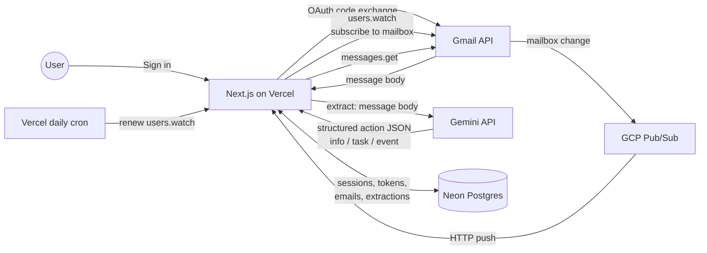

# Overview

`zero` triages a user's Gmail inbox using an LLM. Users sign in with Google, Gmail pushes mailbox-change notifications to the app, the app extracts a structured action (info / task / event) per message via Gemini, and surfaces them in a Next.js UI.

## Components

| Component                    | Role                                                         | Hosted on        |
| ---------------------------- | ------------------------------------------------------------ | ---------------- |
| **Browser (Next.js client)** | React UI: inbox list, triage view, settings                  | Served by Vercel |
| **Next.js server**           | API routes, auth callbacks, Pub/Sub push handler, daily cron | Vercel           |
| **Postgres**                 | Users, OAuth tokens, emails, extractions, action records     | Neon             |
| **GCP Pub/Sub**              | Topic Gmail publishes mailbox-change events to               | GCP (free tier)  |
| **Gmail API**                | Read mail, watch subscriptions, history sync                 | Google           |
| **Gemini API**               | LLM extraction (single thin client in `packages/core`)       | Google           |

## Data flow

## See also

- [Scenarios](./scenarios.md) — sequence diagrams for sign-in, mail ingestion, and watch renewal
- [Tech stack](./tech-stack.md) — concrete tech choices and hosting
