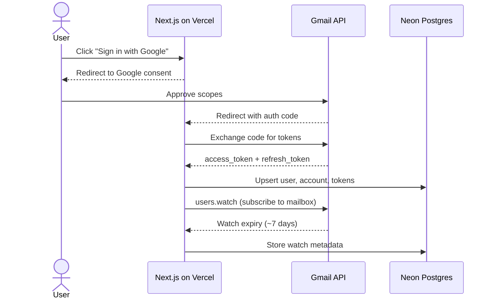
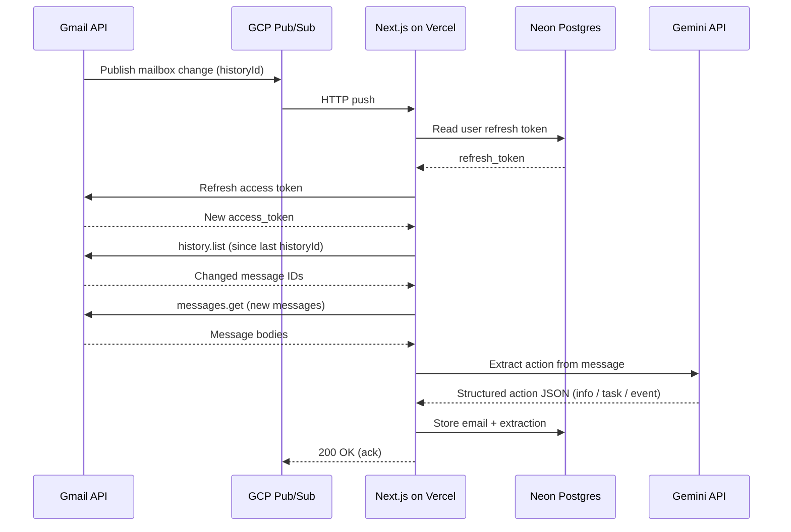
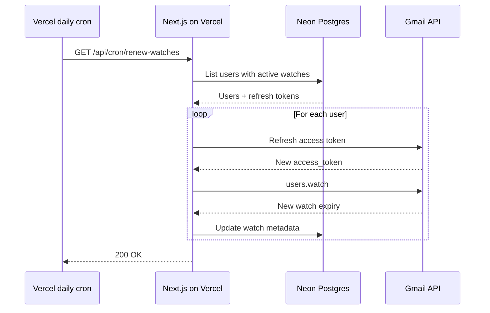

# Scenarios

Dynamic views — what happens, in what order, for each key flow.

## Sign-in

One-time per user. Establishes OAuth tokens and subscribes to mailbox changes.

## Mail ingestion

Per new email. Triggered by a Pub/Sub push from Gmail. Token refresh happens inline before any authenticated Gmail call.

## Daily watch renewal

Gmail's `users.watch` expires after ~7 days. A daily cron re-subscribes for every active user to prevent push interruption.

